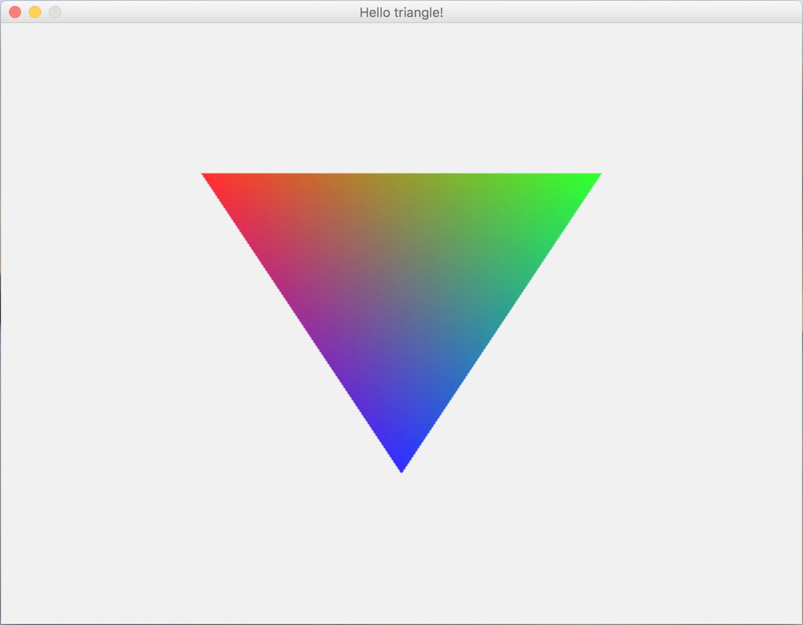

# JVEngine  

<h2>Goal</h2>

The aim of the project is to create simple <b>game engine</b> that is entirely based on <b>Vulkan</b> api.

<h2>Requirements</h2>

<b>Engine</b> is written in <b>Java</b> and is using <b>LWJGL 3</b>. So before you start you should install <b>Java</b> and set up required <b>LWJGL 3</b> libraries(see <b>Required LWJGL libraries</b> bellow).

<h2>Version 0.1.2</h2>

JVEngine is currently in an alfa stage and therefor many functionalities are not added yet. But I highly encourage people new to <b>Vulkan</b> to take a closer look at(at least) some functionalities of JVEngine. For example choosing the right physical device is often very confusing for many beginners, and JVEngine has this function already implemented!

<h2>Required LWJGL libraries</h2>

 It is highly recomended to download default "Minimal Vulkan" preset with JOML selected. You can find it on this website:
https://www.lwjgl.org/. 

<h2>Contribute!</h2>

Developing fully functional game engine is challenging enough for a team of full time developers. Not to say for a guy that is pursuing bechelor's degree at the same time(and hase some other projects too). So any amount of help is more then welcome!

<h2>Gallery</h2>

